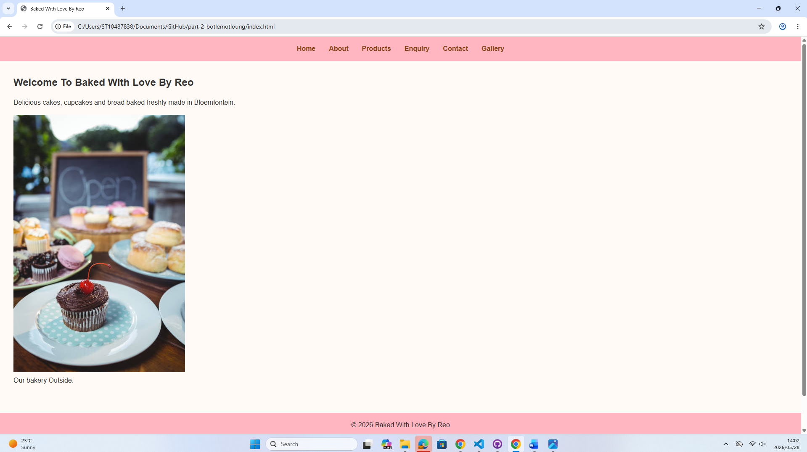
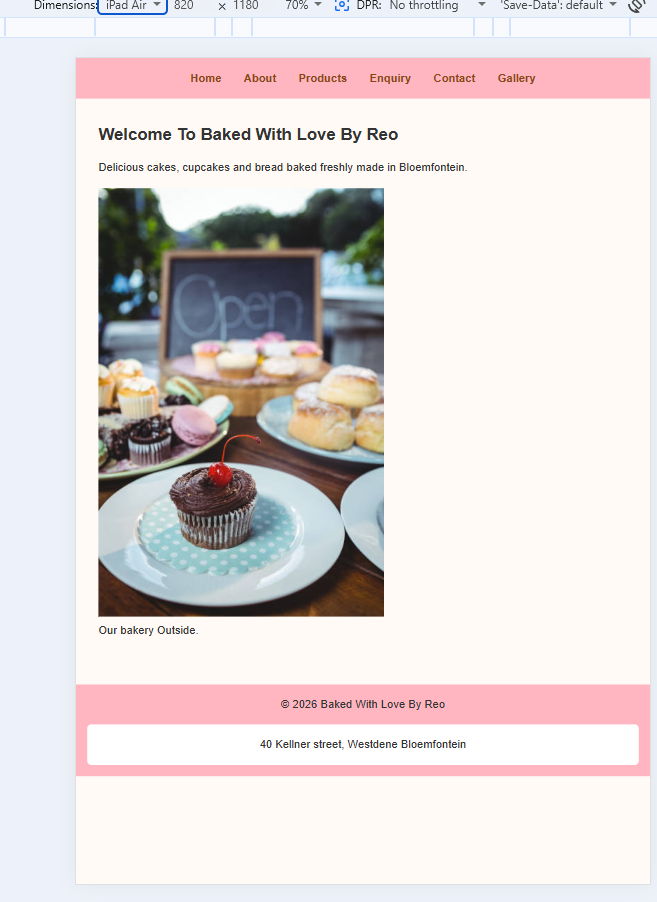
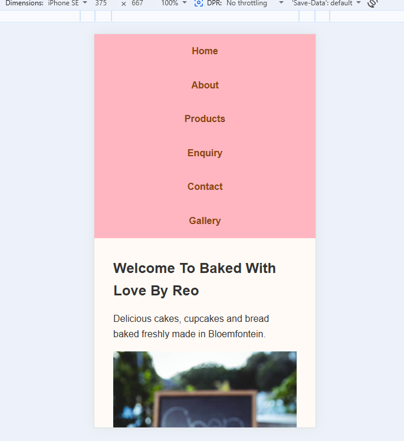

# Baked With Love By Reo

## Student Information

Name: Reoratile Motloung
Student Number: ST10487838
Module: WEDE5020
Assessment: POE Part 2

## Project Overview
This project is a website developed for a small local bakery called **Baked With Love By Reo**, based in Bloemfontein.

The purpose of the website is to:
* Showcase bakery products
* Provide business information
* Allow customers to make enquiries online

## Part 2: CSS Styling and Responsive Design
In Part 2, the website was enhanced using CSS to improve the visual design, usability, and responsiveness.

The following improvements were made:
* Created and linked an external stylesheet (`style.css`) across all pages
* Applied a consistent colour scheme (pink, brown, cream)
* Improved typography using font styles, sizes, and spacing
* Used **Flexbox** for navigation and layout alignment
* Used **CSS Grid** for product and gallery layouts
* Styled buttons, links, and sections for better user experience
* Added hover and focus pseudo-classes for interactivity
* Implemented responsive design using media queries for different screen sizes

## Responsive Evidence
Screenshots were taken using Chrome DevTools device toolbar.

### Home Page
- mobile-home.png — tested at 375px (iPhone SE)
- tablet-home.png — tested at 820px (iPad)
- desktop-home.png — tested at 1280px (desktop)

### Products Page
- mobile-products.png — tested at 375px
- tablet-products.png — tested at 768px
- desktop-products.png — tested at 1280px

### Gallery Page
- mobile-gallery.png — tested at 375px
- tablet-gallery.png — tested at 768px
- desktop-gallery.png — tested at 1280px

## Features and Functionality
* **Home Page:** Introduction and call-to-action buttons
* **About Page:** Business history, mission, and vision
* **Products Page:** Displays bakery items with prices and enquiry links
* **Enquiry Page:** Allows users to submit enquiries
* **Contact Page:** Displays contact details
* **Gallery Page:** Shows product images

## File Structure
project-folder/
├── index.html
├── about.html
├── products.html
├── enquiry.html
├── contact.html
├── gallery.html
├── css/
│   └── style.css
├── assets/
│   ├── images/
│   └── screenshots/
└── README.md

## Changelog

### Part 1

- Created project structure and HTML pages
- Added navigation across all pages
- Added content for all pages
- Created initial README document

### Part 2

- Created css/style.css and linked it to all 6 HTML pages
- Set CSS variables for colour scheme (--primary pink, --secondary brown, --background cream)
- Applied Poppins font-family to headings and Arial to body text
- Used Flexbox on nav ul to centre navigation links with gap spacing
- Used CSS Grid on .products for 3-column layout on desktop
- Used CSS Grid on .gallery for 3-column layout on desktop
- Added :hover effect to nav links changing color to pink
- Added :focus outline to nav links for keyboard accessibility
- Added :hover transform effect to product cards (translateY)
- Added media query at 768px to stack nav vertically and switch to 2-column grid
- Added media query at 600px to switch products and gallery to single column
- Set img max-width 100% and height auto for responsive images
- Fixed aria-current typo in gallery.html nav
- Fixed broken Gallery nav link in about.html
- Fixed phone label tag in enquiry.html
- Fixed submit button syntax in enquiry.html
- Added h1 Contact Us heading to contact.html
- Fixed Milk Tart heading in products.html
- Added .products wrapper div in products.html for grid to apply
- Fixed font-family missing comma in style.css
- Fixed transition invalid unit 0.3a to 0.3s in style.css
- Fixed padding decimal typo 0,5rem to 0.5rem in style.css
- Fixed nav hover color to be visibly different from default
- Added closing brace to img rule in style.css
- Added screenshots for mobile, tablet and desktop views
- Updated references to consistent Harvard format

### Part 3

- Wrote js/script.js and linked it with <script defer> on every page
- Added validation and an inline confirmation message to the Enquiry form
- Added an id, fields, and JS validation to a new Contact form, which opens a pre-filled email to bakedwithlovebyreo@gmail.com on successful submission
- Added a category filter feature to the Products page (All / Cakes / Cupcakes / Bread / Milk Tart / Donuts)
- Added a gallery lightbox modal with keyboard (Escape) and click-outside support
- Added a <h1>Contact Us</h1> and <h1>Our Gallery</h1> to fix missing headings
- Added two embedded Google Maps to contact.html (store + delivery area)
- Added a Home page CTA button linking to Products
- Added unique <meta name="description"> tags to all six pages
- Added Google Fonts link for Poppins so headings render in the intended typeface
- Fixed "occassion" → "occasion" typo in about.html and gallery.html
- Fixed inconsistent products.html title tag
- Added robots.txt and sitemap.xml
- Corrected Responsive Evidence section to match the screenshots actually in the repo

## Accessibility

* Added alt text for images
* Ensured readable font sizes and spacing
* Used colour contrast for readability
* Added hover and focus styles for navigation and buttons

## Screenshots

## References

iStock. (2014) Toast bread. Available at: 
https://www.istockphoto.com/photo/toast-bread-gm522566233-50842866 
(Accessed: 17 May 2026).

iStock. (2018) Girl chef decorates cake with berries. Available at: 
https://www.istockphoto.com/photo/girl-chef-cooks-confectioner-decorates-cake-with-forest-berries-concept-making-gm1005897744-271528940 
(Accessed: 17 May 2026).

iStock. (n.d.) Colourful cupcakes. Available at: 
https://www.istockphoto.com/photo/colorful-cupcakes-gm538166305-58116528 
(Accessed: 17 May 2026).

iStock. (2016) Field of different types of donuts. Available at: 
https://www.istockphoto.com/en/photo/field-of-different-types-of-donuts-gm465529983-33664064 
(Accessed: 27 May 2026).

iStock. (2020) A close up view of two home made delicious milk tart. Available at: 
https://www.istockphoto.com/en/photo/a-close-up-view-two-home-made-delicious-milktart-gm1207293197-348518485 
(Accessed: 27 May 2026).

iStock. (2024) Dozen donuts in box. Available at: 
https://www.istockphoto.com/en/photo/dozen-donuts-in-box-gm2165182934-585400398 
(Accessed: 27 May 2026).

Pixabay. (2022) Milk tarts desserts sweets. Available at: 
https://pixabay.com/photos/milk-tarts-desserts-sweets-7444769/ 
(Accessed: 27 May 2026).

W3Schools. (2026) CSS tutorial. Available at: 
https://www.w3schools.com/css/ 
(Accessed: 20 May 2026).

MDN Web Docs. (2026) HTML and CSS reference. Available at: 
https://developer.mozilla.org/ 
(Accessed: 20 May 2026).
iStock. (2020) Delicatessen bakery store with variety of cupcakes. Available at: 
https://www.istockphoto.com/photo/delicatessen-bakery-store-with-variety-of-cupcakes-gm1257383362-368472917 
(Accessed: 14 March 2026).
iStock. (2022) Different types of baked bread. Available at: 
https://www.istockphoto.com/photo/different-types-of-baked-bread-gm1405538150-457408592 
(Accessed: 14 March 2026).
iStock. (2019) Various different types of sweet cakes in pastry shop glass display. Available at: 
https://www.istockphoto.com/photo/various-different-types-of-sweet-cakes-in-pastry-shop-glass-display-good-assortment-gm1250521452-364760892 
(Accessed: 15 March 2026).
iStock. (2024) Portrait of male and female baker working together in bakery. Available at: 
https://www.istockphoto.com/photo/portrait-of-male-and-female-baker-working-together-in-bakery-gm2271442577-683898128 
(Accessed: 17 March 2026).
iStock. (2015) Cupcake on plate. Available at: 
https://www.istockphoto.com/photo/cupcake-on-plate-gm651218846-118270105 
(Accessed: 20 March 2026).
iStock. (2012) Contact us concept from a bakery. Available at: 
https://www.istockphoto.com/photo/contact-us-concept-from-a-bakery-gm186163634-27610236 
(Accessed: 20 March 2026).

## Conclusion
The website for Baked With Love By Reo successfully meets the requirements 
for Part 2. An external CSS stylesheet was applied across all six pages, 
providing a consistent pink and brown colour scheme throughout.

Flexbox was used for navigation and Grid for the products and gallery layouts. 
Media queries ensure the site responds correctly on mobile, tablet, and desktop 
screens. Accessibility was improved through alt text, aria attributes, hover 
and focus styles, and a consistent heading hierarchy.

All HTML errors from Part 1 feedback have been corrected, references have been 
updated to consistent Harvard format, and the changelog reflects the full 
development history of the project.

## Autograding Feedback
This project may be checked automatically in GitHub Classroom on every push.
Use the Actions or autograding results to see which requirements still need improvement.
